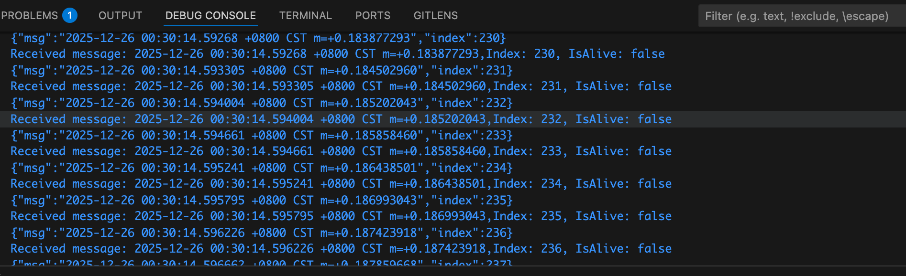
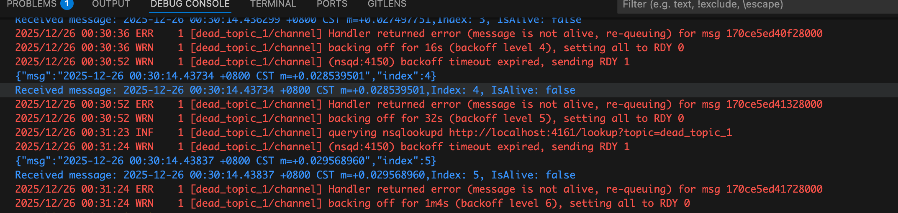

# 使用NSQ收发邮件的时候，堆积的发不出去的消息堆积到4000多的时候会莫名其妙变慢
延迟大概在1-2分钟左右
4000条消息，一条处理失败假设在10ms左右，
实际上的处理延迟在 40000ms = 40s

## 情况0: 正常消费

消费的飞快
## 情况1: 10个Topic,每个Topic，400条堆积消息

每一条消息消费都很慢，要3秒
## 情况2: 1个Topic,4000条堆积消息

## 情况3: 10个Topic,单Topic, 400条堆积消息

